# EraHelper: ERA脚本的[分步解析/更新规则/实时编辑]一体化解决方案


> **！** 目前该脚本仍然出于早期测试阶段，不排除后面会有大量重构的可能，请注意脚本的版本说明

> **！** 建议你采用复制文本内容到原来的脚本的方法更新而不是直接替换
> > 直接替换会导致你的配置数据丢失
---

## EraHelper能为你做什么？
1. 快速配置和使用分步模型分析
2. 便捷地定义Era的更新规则，限制数值更新，进行特殊处理
3. 基于Era的api，更加安全地实时修改Era数据
4. 支持一键导出和导入变量和规则
5. 增强对ERA变量更新的保护，保持结构的强一致性

   ~~6. 纯AI，零人工的脚本代码编写，让你体验极致的屎山代码~~

---


## 使用教程：
[1.分步分析设置](#分步分析设置)

[2.EraData修改](#EraData)

[3.EraDataRule规则](#EraDataRule)


---

**[常见问题及解决方法](./src/ERA助手/doc/常见问题及其解决办法.md)**

---

<span id="分步分析设置"></span>
## 分步分析设置：
#### 导航：
[1.绑定世界书](#绑定世界书)

[2.绑定正则](#绑定正则)

[3.重要提醒](#重要提醒)


<span id="绑定世界书"></span>
### 1）绑定世界书：
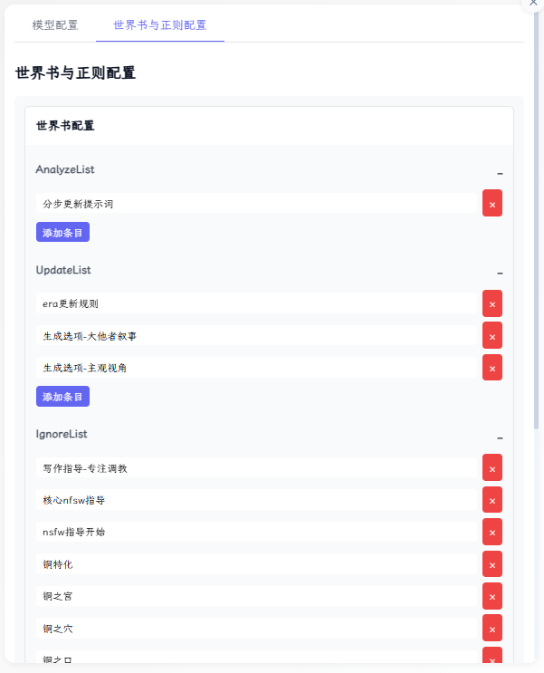

世界书的绑定分为三个部分：
1.  **AnalyzeList**：只在分步模式中发送，用来告诉ai要变量分析任务，你可以参考下面的实现：
    ```text
    #######################
    AI核心执行规则:
    优先级: 最高
    强制执行: true
    AI任务: 重置
    #######################
    接下来你不需要生成任何故事，只需要基于上下文完成下面的任务：
    1.根据<variable_rule>的规则处理变量
    2.生成<options>选项
    ```
2.  **UpdateList**：ERA变量更新的规则，在分步分析模式的“正文生成”中会被过滤
3.  **IgnoreList**：在分步分析模式的“变量生成”中会被过滤
4.  没有绑定的世界书在**任何模式**下都不会被过滤

下面的工作流水图可以帮你了解这个机制：
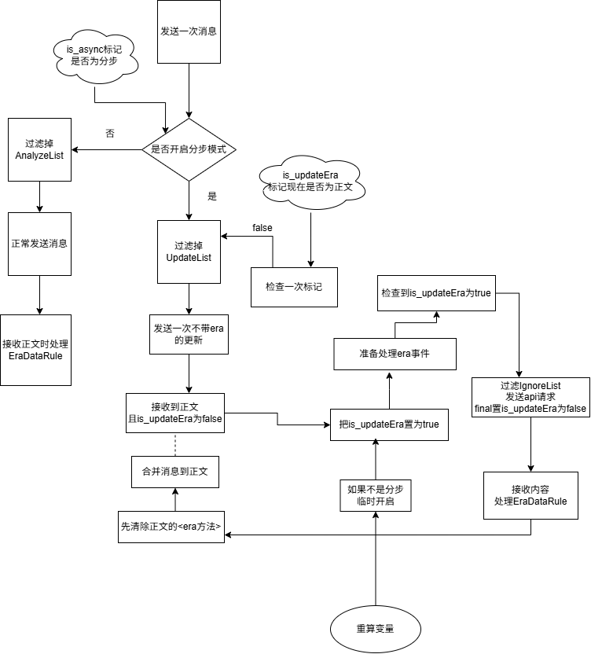

<span id="绑定正则"></span>

### 2）绑定正则
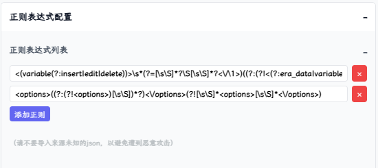

这将会决定在分步分析阶段有哪些内容最终会被提取合并到正文中。

比如：正则`"<options>((?:(?!<options>)[\\s\\S])*?)<\\/options>(?![\\s\\S]*<options>[\\s\\S]*<\\/options>)"`

在分步分步阶段,AI可能会生成：
```text
<thinking>小此思考</thinking>
......小此爽写.....
<tucao>小此吐槽</tucao>
...
<options>
<op>哈气</op>
<op>拱背</op>
<op>老吴</op>
</options>
```
此时`<options>...</options>`所有内容就会被合并到正文中，最终呈现给user选择。而其他无关的部分通通会被过滤掉。

**！** 特别是你应该绑定era的正则，否则分步分析拿不到era的更新。

<span id="重要提醒"></span>

### 3）重要提醒
- 目前分步分析模式不支持流式，否则会导致ejs模板无法正常工作，你辛辛苦苦的编写的分阶段人设就会和AI玩露出play。
- 推荐你使用酒馆助手的宏`{{get_chat_variable::变量}}`为变量赋值，而不是ERA宏`{{ERA:变量}}`，后者在分步分析模式的替换并不稳定。
- 导出角色卡之前一定要检查有没有把额外模型的apiKey清空！~~（和同学们分享你的额度，快点！）~~

---

<span id="EraData"></span>
## 修改Era数据:
- ERA助手提供了一种更便捷的方式修改Era数据，你可以在ERA助手中直接修改Era数据，或者将数据导入导出。
- 因为新版本的ERA在更新变量时完全基于eraLog，而stat_data只能单方面响应era的变量的改变，因此你无法通过酒馆助手来修改Era数据。
  - 你还需要注意的是:
    - ERA助手调用的是ERA脚本的api进行修改，
    - 这和ai编辑变量的方式没什么区别
    - 因此仍然会收到`$meta`字段的限制
      比如：
    ```json
    {
      "角色":{
        "张小花":{...},
        "$meta": {
          "necessary": "all"
        }
      }
    }
    ```
  如果你尝试直接删除`"张小花":{}`，则不会成功，这是因为ERA的`necessary`字段为"张小花"提供了保护。
  你必须先删除`"necessary"`->保存->然后再删除`"张小花"`。
  这与AI修改变量的方式保持了一致性。

---


<span id="EraDataRule"></span>
## EraDataRule：
- 让Era在进行更新之前，先进行一段自定义的逻辑处理，可以做到从简单的范围、变化值限制，到一个复杂的逻辑处理。
- 目前只会对`<VariableEdit>`进行处理。
- 强制要求变量类型的一致性：阻止“哈基米错误把对象更新为字符串”等等。
- 支持导入导出rule配置，这代表你可以方便地让ai帮助你。
- 提供交互式的rule编辑器前端，强大的可视化，语法检查，一键测试，日志追踪功能。

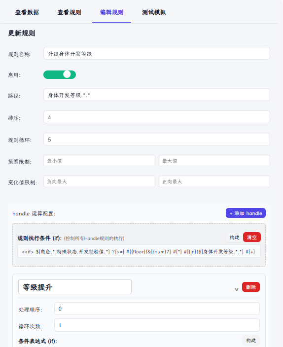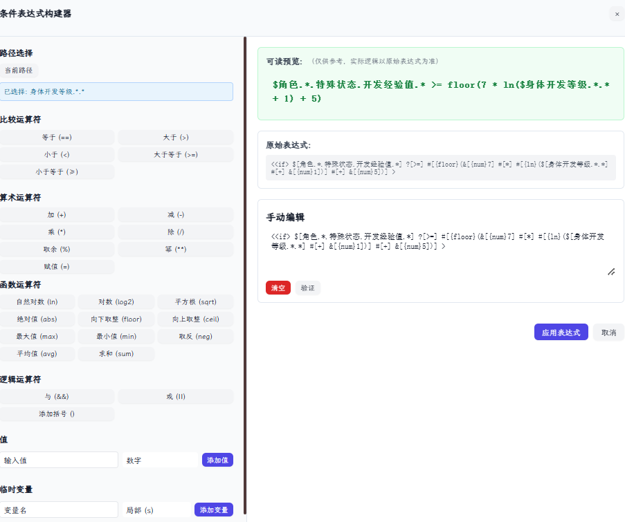

### v1.2.0更新后
在消息处理完毕后，会发送一个`kat:handle_era_finished`事件作为完成标记，其对标的是酒馆的`message_received`事件
你可以监听该事件继续下一步的处理,如：
```js
eventOn('kat:handle_era_finished', () => {
eraLogger.log('监听到kat:handle_era_finished');
})
```

#### 通过AI生成rule规则提供的文档和类型定义，你需要把它们喂给ai：
[写给AI的EraDataRule规则.md](./src/ERA助手/doc/给AI用/写给AI的EraDataRule规则.md)

[示例-一份完整的era-rule.json](./src/ERA助手/doc/给AI用/示例-一份完整的era-rule.json)

[EraDataRule类型定义.ts](./src/ERA助手/EraDataHandler/types/EraDataRule.d.ts)

> 下面讲述如何配置rule规则，前端提供了交互式的规则生成器。
这个部分可能会比较复杂，但是我建议你了解一下，这可以帮助你更好地理解这个机制。

### 导航
[1.核心概念与结构](#核心概念与结构)

[2.完整示例](#完整示例)

[3.实操编写](#实操编写)


### 帮你读懂`EraDataRule`

`EraDataRule` 是一种用来定义 **自动化数据修改规则** 的配置。你可以通过它来创建复杂的逻辑，例如“当角色经验值满100时，循环处理升级，直到经验值不足为止”，而无需编写代码。
如果只是想简单地限制数据范围，那么 `range` 和 `limit`也可以满足你的基本需求。

---

<span id="核心概念与结构"></span>
### 核心概念与结构

一个规则 (`Rule`) 主要由以下部分构成：

| 属性 | 级别 | 说明 |
| :--- | :--- | :--- |
| **`path`** | 规则 | 规则主要影响的数据路径，如 `角色.*.等级`。也为通配符 `*` 提供匹配上下文。 |
| **`order`** | 规则/操作 | 决定执行顺序，数字越小越先执行。规则和其内部的操作 (`handle`) 各自排序。 |
| **`if`** | 规则/操作 | **条件判断**。`规则`的 `if` 是**总开关**，控制其下的所有操作；`操作`的 `if` 只控制**当前那一条操作**。 |
| **`loop`** | 规则/操作 | **循环次数**。`规则`的 `loop` 会**重复执行其包含的全部操作**；`操作`的 `loop` 只会**重复执行当前操作**。 |
| **`handle`** | 规则 | **操作处理器集合**。包含一条或多条具体的数据修改指令 (`op`)。 |
| **`range`/`limit`**| 规则 | **数值范围限制**。在规则的每一轮循环中，所有 `handle` 执行完毕后，最后对 `path` 的值进行修正。 |

---

### 核心执行流程

理解执行顺序至关重要。系统严格按照以下流程处理所有规则：

```
// 1. 按 order 顺序遍历所有启用的规则
for(rule in rules){
  // 2. 对单个规则进行 loop 循环
  for(rule: loop循环){
    // 3. 检查规则级的 if 条件
    if(rule.if == false){
       data = data -> 执行 range //range和limit至少会被执行一次
       data = data -> 执行 limit
       break; // 如果条件不满足，则直接跳出当前规则的循环
    }
    // 4. 按 order 顺序遍历规则内的所有 handle
    for(handle in handles){
      // 5. 对单个 handle 进行 loop 循环
      for(handle: loop循环){
        // 6. 检查 handle 级的 if 条件, 不满足则跳出循环
        if(handle.if == false) break;
         // 7. 执行 handle 的 op 操作，数据会立刻被修改
          data = data -> 执行 handle.op
      }
    }
    // 8. 在一轮 rule 循环的最后，对 path 的值应用范围限制
    data = data -> 执行 range
    data = data -> 执行 limit
  }
}
```

---

### 如何编写操作语句 (`if` / `op`)

使用一种简单的专用语法 (DSL) 来编写。

1.  **引用数据值**: `$[路径]`
*   `$[角色.主角.等级]`

2.  **使用固定值**: `&[{类型}值]`
*   `&[{num}100]` (数字), `&[{str}你好]` (字符串)

3.  **编写条件 (`if`)**: `?[判断符]`
*   支持 `==`, `>`, `<`, `>=`, `<=` `!=`及逻辑运算 `&&` (与), `||` (或)。
*   **示例**: `<<if> $[角色.主角.等级] ?[>] &[{num}10] >`

4.  **编写操作 (`op`)**: `#[操作符]`
*   **赋值**。`#[=]`。
*   **算术**: `#[+]`, `#[-]`, `#[*]`, `#[/]`
*   **函数**: `#[{max}$[值1]$[值2]]` (取最大值), `#[{sqrt}$[值]]` (开平方) 等。
*   **逻辑**: `#[{if}$[条件]#[{then}$[操作]#[{else}$[操作]]]`
*   **临时变量**: `@[{s}变量名](局部变量)` `@[{g}变量名](全局变量)`
*   **示例**: `<<op> $[角色.*.好感度] #[=] $[角色.*.好感度] #[+] &[{num}10] >`

完整的dsl语句定义请参阅[DSL语法定义](./src/ERA助手/EraDataHandler/types/EraDataRule.d.ts)

**重要细节**： 赋值语句`#[=]`不会检查数据类型，但是合并保护机制会检查数据类型是否一致。因此你在测试中可能会看到赋值成功执行了，但是没有产生任何结果。

---

### 通配符路径
你可以便捷地使用通配符 `*` 来代表一级路径,解释器将会智能地基于同一个上下文绑定。

**通配符 `*` 的绑定规则：按位顺序匹配**
*   表达式中，所有路径里**第1个** `*` 互相绑定，**第2个** `*` 互相绑定，以此类推。
*   **示例**：执行 `$[角色.*.经验.*] #[+] $[身体.开发等级.*.*]`
*   系统会将其解析为一系列具体操作，例如：
*   `$[角色.小明.经验.左手] #[+] $[身体.开发等级.小明.左手]`
*   `$[角色.小红.经验.右手] #[+] $[身体.开发等级.小红.右手]`
*   `小明` 同时作为第一个 `*` 的值，`左手` 同时作为第二个 `*` 的值。

通配符的上下文只会在一条rule中生效。不同rule之间的`*`不会互相绑定。

`$[*]`是一个特殊的路径，它表示全局操作，即完全基于handle表达式进行操作，它本身不表示任何路径，因此无法使用limit和range，自身的`*`也不会进入通配符的上下文。

---

### 临时变量
你可以使用临时变量来保存中间结果，并使用 `@[{作用域}变量名]` 来引用。
- `@[{s}变量名]`表示局部变量，只在当前rule中生效
- `@[{g}变量名]`表示全局变量，可以在不同的rule之间传输数据
- 你必须先为临时变量赋值，然后再使用，否则会求值器报错

---

<span id="完整示例"></span>
### 完整示例：角色循环升级规则

**目标**：当任意角色的经验值（`EXP`）达到或超过100时，自动循环处理升级，直到经验值不足100为止。

```json5
{
  "角色循环升级": {
    "path": "角色.*.EXP", // 规则主要监控的目标
    "enable": true,
    "order": 100,
    // 规则级的 if，作为整个升级流程的“总开关”
    "if": "<<if> $[角色.*.EXP] ?[>=] &[{num}100] >",
    // 规则级的 loop，允许角色一次性升多级
    "loop": 10, // 最多连续升10级，防止意外的无限循环
    "handle": {
      "升级操作": {
        "order": 1, // 步骤1：先升级
        // 此处无需再写if，因为父级的if已经保证了经验值足够
        "op": "<<op> $[角色.*.LV] #[=] $[角色.*.LV] #[+] &[{num}1] >"
      },
      "扣除经验": {
        "order": 2, // 步骤2：再扣经验
        "op": "<<op> $[角色.*.EXP] #[=] $[角色.*.EXP] #[-] &[{num}100] >"
      }
    }
  }
}
```
**工作流程解析**：
1.  系统找到一个经验值 `>= 100` 的角色（例如“主角”）。
2.  规则的 `if` 条件为真，进入 `loop` 循环（第1次）。
3.  执行 `handle: 升级操作`，“主角”等级+1。
4.  执行 `handle: 扣除经验`，“主角”经验值-100。
5.  第1次循环结束。系统回到 `loop` 的起点，准备进行第2次循环。
6.  再次检查规则的 `if` 条件。如果“主角”剩余的经验值仍然 `>= 100`，则重复步骤3-5。如果不足100，`if` 条件为假，`break` 循环，此角色的升级处理结束。

---

<span id="实操编写"></span>
### 实操！使用ERA助手编写rule规则

我们来编写两条规则：
- 限制角色的好感度变化在[-5,10],范围在[0,1000]。
- 当角色`星宫诗羽`的好感度超过390时，将角色`白石䌷`的`已出场`置为`true`

>首先，我们提前收集好需要的路径。

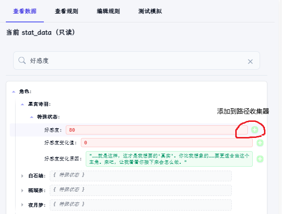

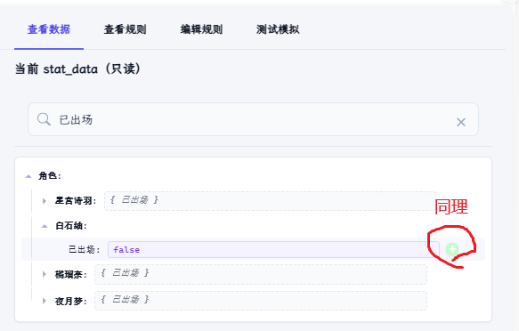

>接下来，开始编写规则。
把名称，路径，排序等通通都填写好。

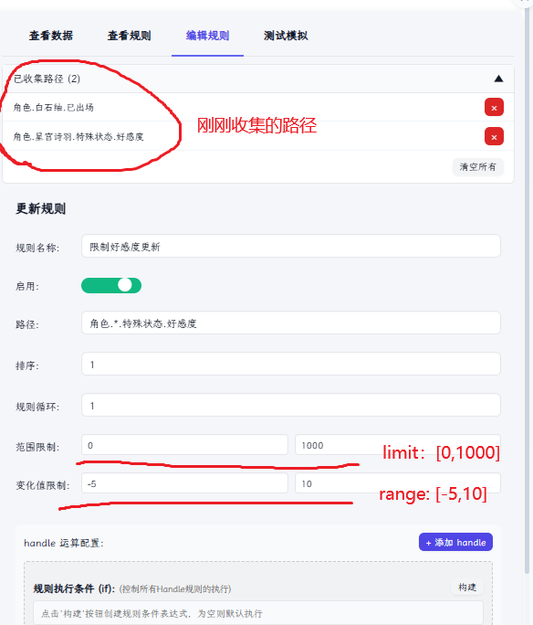

>点击保存，第一条规则就写好了。

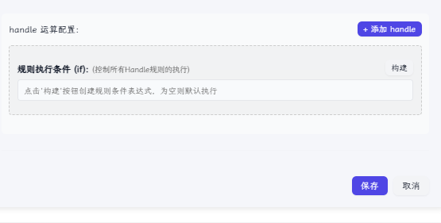

>是不是非常简单？

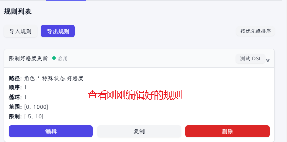

>来编写第二条规则。


>注意handle和rule也不可以重名哦。
打开handle表达式。


>可能一眼看上去会有一点点复杂，但是只要一边写一边盯着绿框框看，就能保证自己不会写错了。

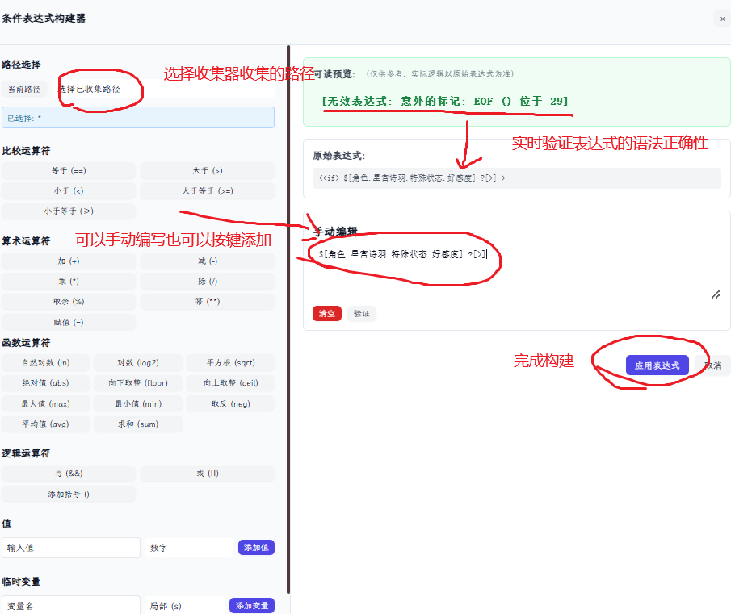

>快速编写好两条规则。

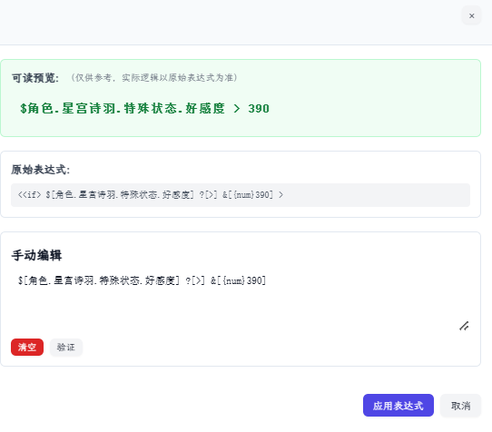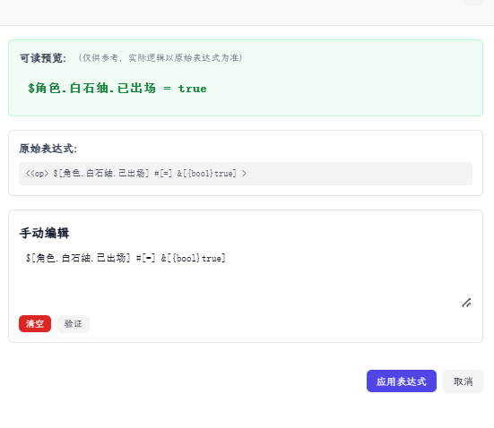

>保存规则。

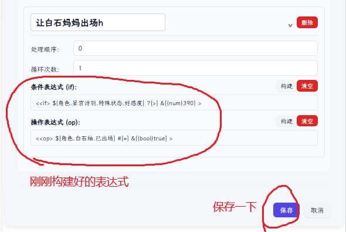

>现在我们已经把规则写好了，但是千万不要忘记进行测试哦。

>在开始测试之前，我们先来构建一下测试数据。

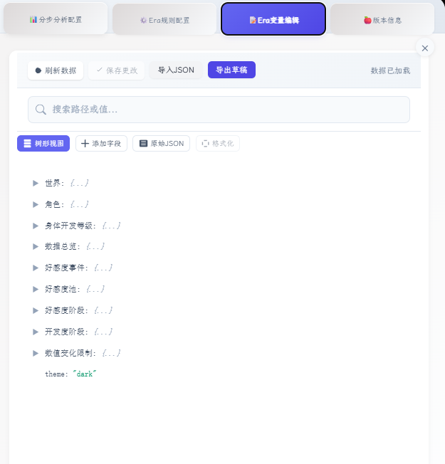

>我还是比较喜欢原始Json模式，信息量比较大。

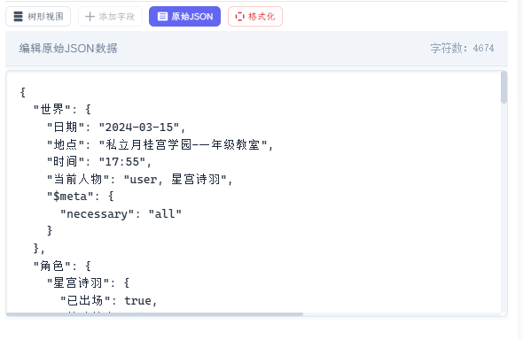

>这里随便构造好了数据，注意留意红圈圈的地方哦。

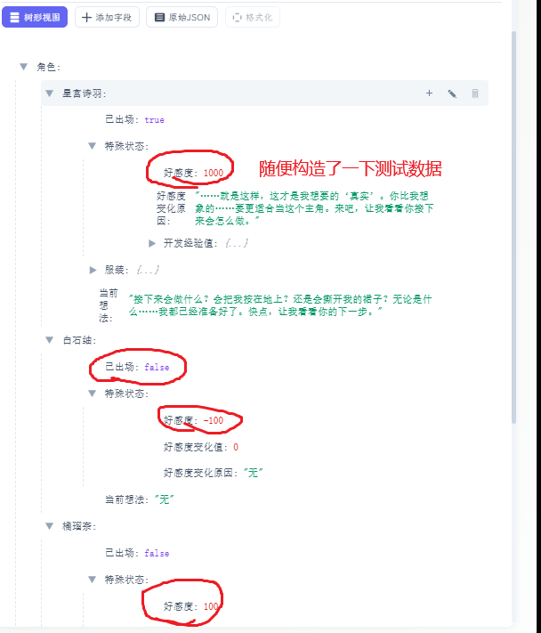

>导出一下刚刚编辑的草稿。


>有了测试数据，我们就可以开始测试啦！耶！

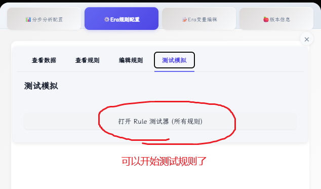

>导入测试数据，点击运行结果。

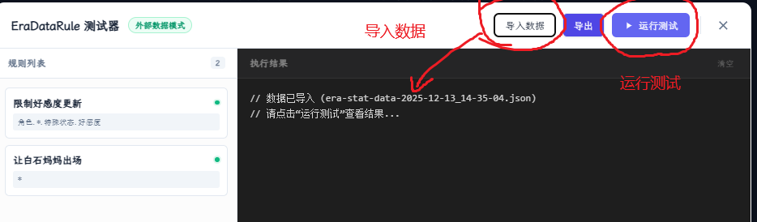

>有人可能想问了，对照的数据是什么呢？答案是当前的stat_data。
> >所以如果想要测试一些特殊情况，应该要在刚刚编辑的地方导入一份stat_data哦。

>真是太好了！测试结果完全符合我们的预期。

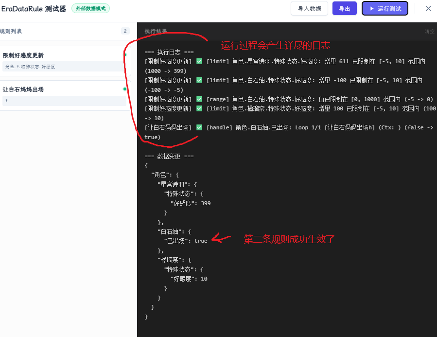

> 不恭喜你们，恭喜我自己！终于完成了一份规则的编写。

> 接下来写一个宇宙无敌超级史诗传说复杂的嵌套规则逻辑来闪瞎987的眼睛吧！
